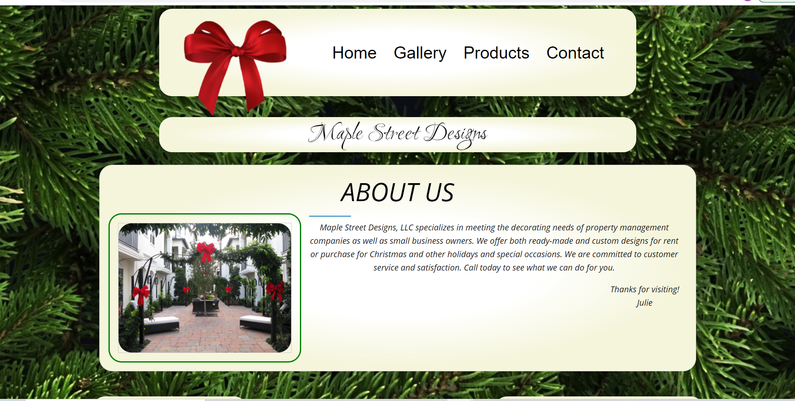

# Maple Street Designs



## About This Project

This is a buisness site for Maple Street Designs.

### Built With

  - React.js
  - Zurb Foundation

## Starting the app locally

Start by installing front and backend dependencies. While in this directory, run the following command:

```
npm install
```

This should install node modules within the server and the client folder.

After both installations complete, run the following command in your terminal:

```
npm start
```

Your app should now be running on <http://localhost:3000>. The Express server should intercept any AJAX requests from the client.

## Contact

Michael - r.michael.eason@gmail.com

Project Link: https://maple-street-designs.herokuapp.com/

## Acknowledgements

  - Zurb Foundation
  - Font Awesome
  - Google Fonts
